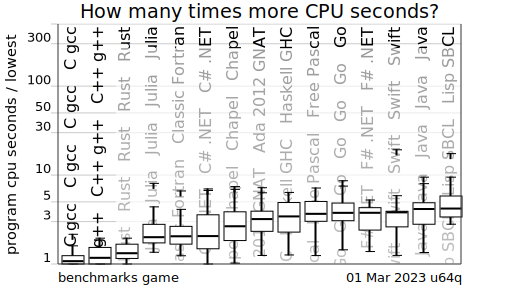
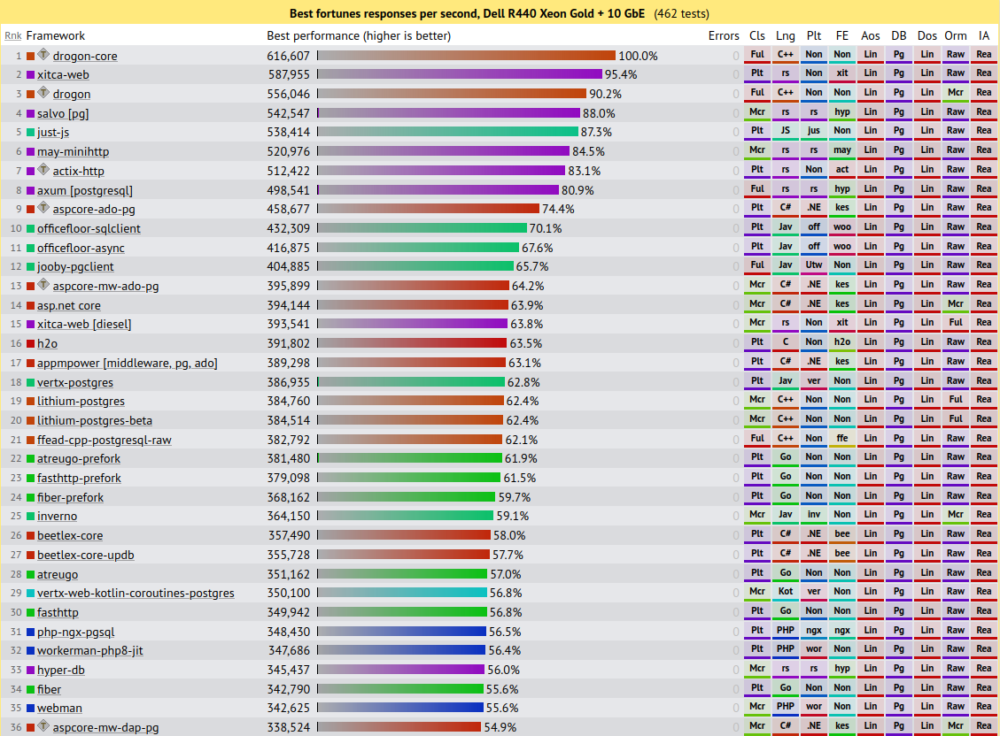
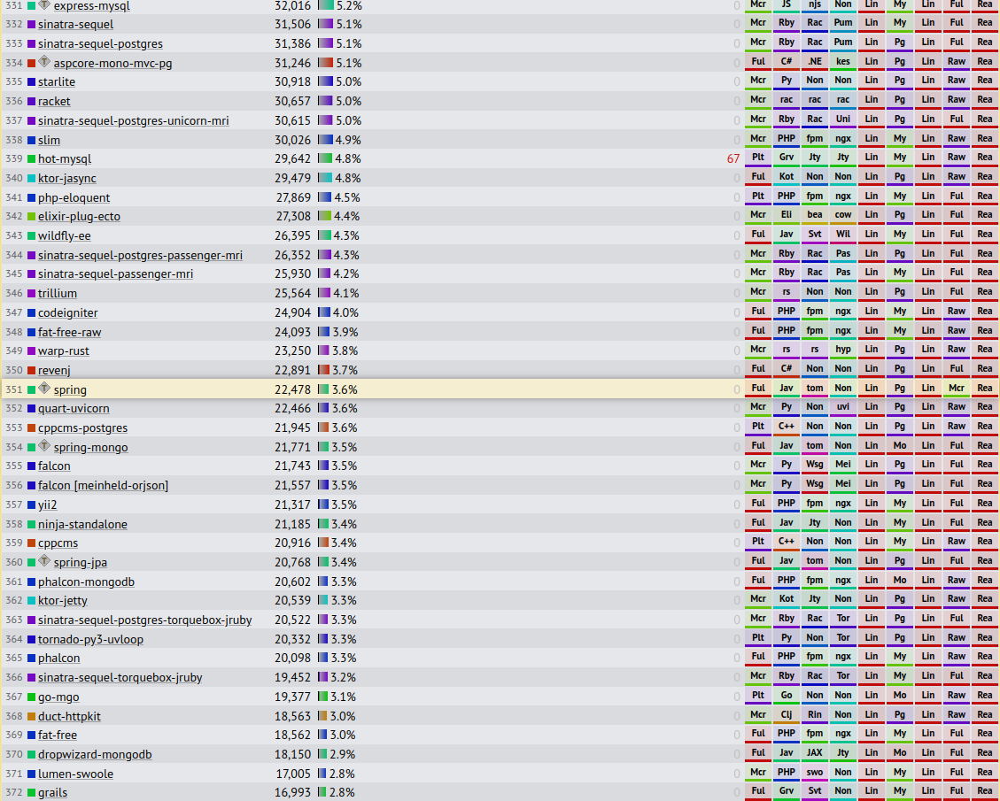

# <!--fit--> PV281: Programování v Rustu

---

# Obsah

- Organizační informace
- Hodnocení předmětu
- Co za semestr probereme?
- O Rustu a jeho historii
- Úvod do Rustu a jeho syntaxe
- Základní typy a řízení toku programu

---

# <!--fit--> Organizační
# <!--fit--> informace

---

# Interaktivní osnova

Primárním zdrojem informací během semestru je předmětová [Interaktivní osnova](https://is.muni.cz/auth/el/fi/podzim2023/PV281/index.qwarp).

---

# Přednášky

**2h týdně**, vždy v pondělí v 18–20 hod.

Přednášející:
**Lukáš Grolig**, Ondřej Hrdlička, Ondřej Holub, Stanislav Zeman

Během přednášky projdeme teorii a základní příklady.

---


Přednášky jsou nahrávané a dostupné v ISu.

Dostupnost záznamů bude 14 dní po přednášce.

---


Stream přednášek na [Twitchi](https://www.twitch.tv/vexfalard).

---

# Cvičení

**2h** týdně, celkem 12 cvičení

Cvičící: **Vrbka, Holub, Hrdlička, Chudíček & Mišík, Zeman, Adamove, Šlézar & Wehrenberg**

Na cvičení si zopakujete probranou látku a budete vypracovávat příklady s pomocí cvičících.

---

# Poděkování

Tomášovi Sedláčkovi a Ondrovi Hrdličkovi za pomoc s organizací předmětu.

Katce Pitoňákové za přípravu prvního běhu předmětu.

---


Organizační informace, diskuze k Rustu, pomoc s úkoly či projekty, hledání týmu, ...

https://discord.gg/fJZxQMNgKf

---

# <!--fit--> Hodnocení

---

# Hodnocení předmětu

Maximum bodů: **100**
Minimum pro úspěšné zakončení předmětu: **75**

---

### Hodnocení
###### Cvičení

* Možnost získat bonusové body
* Účast není povinná, ALE 
  za aktivní účast získáte **možnost opravit si odevzdání iterace**
  <small>(toto pravidlo platí od 3. týdne semestru včetně)</small>

---

### Hodnocení
###### Iterace

* Celkem **10 iterací**
* Každá za **maximálně 5 bodů**
* Každá z nich vás seznámí s konktrétní funkcionalitou Rustu
* Automaticky testované, opravující kontroluje kvalitu kódu
<br>
* V základu máte 1 pokus na odevzdání
* Po code review můžete, ale nemusíte využít možnost opravy získanou na základě aktivní účasti na cvičení

---

### Hodnocení
###### Týmový projekt

* **50 bodů** za týmový projekt zakončený obhajobou ve zkouškovém
<br>
* **4členné**, výjimečně 3členné **týmy** – nikdy ne méně ani ne více
* Týmy lze vytvářet **napříč seminárními skupinami**.
* Složení týmu lze měnit do 10. týdne semestru (včetně).
<br>
* Zadání projektu jsou volná, očekáváme kreativitu týmu při vlastním dodefinování zadání.
* Zadání plánujeme zveřejnit ve **3. týdnu** semestru.

---

### Hodnocení
###### Bonusové body

* Na přednášce za aktivitu
* Na cvičeních za aktivitu
* Za dobrovolné, bonusové podčásti iterací
* Za špičkové zpracování úkolů/projektu a výrazné překročení rozsahu

---

# <!--fit--> Co za semestr probereme?

---

# Probíraná látka

* Úvod - historie, hlavní (ne)výhody Rustu, založení projektu
* Syntaxe jazyka a jeho specifika
* CLI aplikace a práce se soubory, obsluha chybových stavů
* Iterátory a datové struktury
* Paralelní programování, strukturování projektu
* Asynchronní programování

---

# Probíraná látka

* Práce s databází
* RESTové služby v Actix
* Server-side aplikace v Actix a HTMX
* Desktopové aplikace v Tauri
* gRPC protokol
* Unsafe Rust, makra a foreign function interface

---

# Probíraná látka mimo Rust

* Budeme hodně pracovat s Gitem a GitLabem
* Budeme psát čisté SQL

---

# Studijní materiály

###### Web
[The Rust Programming Language](https://doc.rust-lang.org/book/)
[Rust By Example](https://doc.rust-lang.org/stable/rust-by-example/)

###### Literatura
Programming Rust: Fast, Safe Systems Development, 2nd Edition

###### Pokročilá literatura
Rust for Rustaceans: Idiomatic Programming for Experienced Developers

---

# <!--fit--> O Rustu a jeho historii

---


Seznamte se: 
**Krab Ferris**

---

# Historie

* Rust vznikl v Mozille
* Cílem bylo vytvořit jazyk bez garbage kolekce s bezpečnou prací s pamětí

---


70% bezpečnostních děr v Microsoftu bylo spojených s prací s pamětí.

https://msrc-blog.microsoft.com/2019/07/16/a-proactive-approach-to-more-secure-code/

---

# Rust Foundation

Mozilla  ale dál nezvládala sama rozvíjet Rust. To vedlo ke vzniku Rust Foundation v roce 2020.

Zakládajícími členy se stali:

  
 

---

# Další známé firmy využívající Rust

Tento seznam se už hodně natáhl, ale můžeme jmenovat:
**1Password, Apple, Canonical, Cloudflare, Discord, Dropbox, Figma, Facebook, System76, OVH**

---

# Hlavní výhody Rustu

#### Bezpečnost

V jazycích typu C vznikají problémy s manuální správou pamětí jako dangling pointer, dvojité uvolnění aj.
V moderním C++ je spousta věcí řešena technikami jako je RAII nebo smartpointy.
Rozdílem je, že Rustu toto nemusí nehlídat člověk, ale řeší překladač.

Cenou za to je doba překladu.

---


---

# Hlavní výhody Rustu

#### Rychlost

Prakticky všechny dnešní jazyky jsou pomalejší než C a C++.
Je to kvůli abstrakcím, garbage kolekci aj.
Výsledný program běžící v Rustu je na stejné úrovni v rychlosti běhu jako C/C++.

To máme díky:
* **zero cost abstrakci**
* **správě paměti během kompilace**

---

<style scoped>

section {
  background-color: white;
}

</style>



---

### Srovnání Rustu s C


---

### Srovnání Rustu s C


---

### Porovnání frameworků ve Fortunes



---

### Porovnání frameworků ve Fortunes



---

# Konkurence

Při paralelním programování často dochází k všemožným problémům. Rust díky síle překladače (rozumějte statickým kontrolám), pravidlům a konvencím v jazyce poskytuje podstatně větší jistotu.

---

# Další výhody

* jazyk nemá dědičnost, místo toho vyžaduje kompozici
* neexistuje `null`
* moderní a pokrokový tooling
  + správce závislostí
  + dokumentování kódu
  + testování

---

# Nevýhody Rustu

* Pomalý překlad
* Velké množství knihoven v ekosystému stojí na jedincích
* Často více psaní než v jiných jazycích

---

## Jak se rozhodovat při výběru jazyka?

Potřebuju jednoúčeloový rychle **naprasený tool**? Python.
Bude to běžet v prohlížeči nebo je to **UI**? JS nebo TS.
Můžu použít **managovaný jazyk**? Golang > C#, Kotlin > Java.

Jinak vyberu **Rust**!

Rustu nahrává i lepší udržovatelnost codebase, rychlost nebo nižší chybovost kódu.

---

### K čemu se dnes Rust primárně používá?

* tooly - CLI nebo integrované
* webové aplikace a služby
* knihovny pro jiné jazyky
* nízkoúrovňové aplikace - ovladače, jádro OS, firmware

---

# Příběh Discordu

---

# Příběh Discordu

> As usual with a garbage collected language the problem was CPU stalls due to garbage collection spikes.
> But in non-GC languages you have to worry about memory fragmentation, especially for long-lived processes.
> When you get that sev 1 bug that happens after two months of flawless execution it will often be a memory allocation failure due to memory fragmentation.
> 
> So you end up creating your own memory allocator anyway.

---

# Příběh Discordu

> When we started load testing, we were instantly pleased with the results. The latency of the Rust version was just as good as Go’s and had no latency spikes!
> 
> Remarkably, we had only put very basic thought into optimization as the Rust version was written.
> Even with just basic optimization, Rust was able to outperform the hyper hand-tuned Go version. 

---

# Příběh Discordu

> After a bit of profiling and performance optimizations, we were able to beat Go on every single performance metric. Latency, CPU, and memory were all better in the Rust version.

---

# Příběh Discordu

> Along with performance, Rust has many advantages for an engineering team. For example, its type safety and borrow checker make it very easy to refactor code as product requirements change or new learnings about the language are discovered. Also, the ecosystem and tooling are excellent and have a significant amount of momentum behind them.
> 
> Also, our business case for using Go - it's all about saving money.

---

# Příběh Discordu

http://highscalability.com/blog/2020/2/7/stuff-the-internet-says-on-scalability-for-february-7th-2020.html

https://blog.discord.com/why-discord-is-switching-from-go-to-rust-a190bbca2b1f

---

# <!--- fit --> Úvod do Rustu
# <!--- fit --> a jeho syntaxe

---

# Verzování Rustu

`nightly`
vydáváno každodenně

`beta`
vydávána jednou za 6 týdnů

`stable`
vydávána jednou za 6 týdnů (následujících po betě)


---

# Problémy verzování

Dříve nebyly všechny features dostupné ve stabilní verzi. Tvůrci frameworků proto sahali po nightly, a ta musela být používaná i v projektu. 

Dnes už to neplatí a použití nightly verze se snažíme vyhnout.

Je vhodné zmínit, že Rust se rychle vyvíjí. Je proto nutné hlídat, které vlastnosti jsou deprekovány, a naopak nově přidány.

---

# Nové verze jazyka jsou testovány na dostupných crates!

---

### Instalace Rustu

Instalaci a aktualizaci Rustu doporučujeme provádět přes `rustup`.

###### UN*X

```shell
curl --proto '=https' --tlsv1.2 -sSf https://sh.rustup.rs | sh
```

###### Windows
Stáhnout [rustup-init.exe](https://static.rust-lang.org/rustup/dist/x86_64-pc-windows-msvc/rustup-init.exe) a řídit se pokyny instalátoru.

###### MacOS
Pokud máte homebrew, tak `brew install rustup`.

---

# Základní nástroje

`rustup` – spravuje verze Rustu

`rustc` – překladač

`cargo` – balíčkovací systém, spráce projektu a závislostí

`clippy` – linter

---

# IDE

###### VS Code 
s pluginem `rust-analyzer` - neinstalujte plugin jménem "Rust" (starý, deprekovaný, nahrazený)

###### Jetbrains CLion
s pluginem `Intellij Rust`

###### Jetbrains RustRover
vyšel _Early Access_ od minulého týdne (09/2023)

---

# Založení nového projektu

Příkazem

```shell
cargo new nazev_projektu
```

se vytvoří nový projekt:

```
nazev_projektu
+-- Cargo.toml
+-- src
│   +--main.rs  
```

---

# Překlad a spuštění

```shell
cargo build
cargo run
```

---

# Cargo.toml

```toml
[package]
name = "hello_world"
version = "0.1.0"
edition = "2021"
authors = ["Your Name <you@example.com>"]

[dependencies]
rand = { git = "https://github.com/rust-lang-nursery/rand.git" }
```

---

# Cargo.lock

```toml
# This file is automatically @generated by Cargo. It is not intended for manual editing.

[[package]]
name = "hello_world"
version = "0.1.0"
dependencies = [
 "rand",
]

[[package]]
name = "rand"
version = "0.9.0"
source = "git+https://github.com/rust-lang-nursery/rand.git#f3dd0b885c4597b9617ca79987a0dd899ab29fcb"
dependencies = [
 "libc",
 "rand_chacha",
 "rand_core",
]

# ...
```

---

### Složitější struktura projektu

<style scoped>
pre code svg[data-marp-fitting=svg] {
  max-height: calc(50vh - 1em);
}
</style>

```
+-- Cargo.lock
+-- Cargo.toml
+-- src/
│   +-- lib.rs <----------------------------------- základní soubor knihovny
│   +-- main.rs <---------------------------------- základní spustitelný soubor
│   +-- bin/ <------------------------------------- veškeré další spustitelné soubory
│       +-- named-executable.rs
│       +-- another-executable.rs
│       +-- multi-file-executable/
│           +-- main.rs
│           +-- some_module.rs
+-- benches/ <------------------------------------- benchmarky
│   +-- large-input.rs
│   +-- multi-file-bench/
│       +-- main.rs
│       +-- bench_module.rs
+-- examples/ <------------------------------------ ukázky kódu
│   +-- simple.rs
│   +-- multi-file-example/
│       +-- main.rs
│       +-- ex_module.rs
+-- tests/ <--------------------------------------- integrační testy
    +-- some-integration-tests.rs
    +-- multi-file-test/
        +-- main.rs
        +-- test_module.rs
```

---

# Ukázka kódu z main\.rs

```rust
fn main() {
    println!("Hello, world!");
}
```

* Všimněte si, že `main` nevrací hodnotu. Později zjistíte, že může vracet `Result`.
  Pro explicitní návratový kód také existuje funkce `std::process::exit(code: i32)`.
* `println!()` je makro. Poznáme ho podle vykřičníku.

---

# Přidání crate pro CLI aplikace

Závislost na crate `clap` přidáme příkazem `cargo add clap`.

```rust
use std::path::PathBuf;
use clap::{arg, command, value_parser, ArgAction, Command};

fn main() {
    let matches = command!()
        .arg(arg!([name] "Optional name to operate on"))
        .arg(arg!(
            -d --debug ... "Turn debugging information on"
        ))
        .get_matches();
    
    // Continued on the next slide...
}
```

---

# Kontrola argumentů

```rust
fn main() {
    // ...continued from the previous slide.

    if let Some(name) = matches.get_one::<String>("name") {
        println!("Value for name: {name}");
    }

    match matches
        .get_one::<u8>("debug")
        .expect("Count's are defaulted")
    {
        0 => println!("Debug mode is off"),
        1 => println!("Debug mode is kind of on"),
        2 => println!("Debug mode is on"),
        _ => println!("Don't be crazy"),
    }
}
```

---

# <!--fit--> Základní typy
# <!--fit--> a řízení toku programu

---

# Celočíselné typy

| Velikost         | Znaménkový | Neznaménkový |
|------------------|------------|--------------|
| 8 bitů           | i8         | u8           |
| 16 bitů          | i16        | u16          |
| 32 bitů          | i32        | u32          |
| 64 bitů          | i64        | u64          |
| 128 bitů         | i128       | u128         |
| dle architektury | isize      | usize        |

---

# Zápisy literálů

| Velikost     | Příklad     |
|--------------|-------------|
| desítkové    | 98_222      |
| šestnáctkové | 0xff        |
| osmičkové    | 0o77        |
| binární      | 0b1111_0000 |
| bajtové      | b'A'        |

---

# S plovoucí řádovou čárkou (IEEE-754)

| Velikost | Typ |
|----------|-----|
| 32 bitů  | f32 |
| 64 bitů  | f64 |

Výchozí je `f64`.

---

# Definice proměnné

```rust
let number = 42;
let number: i16 = 42i16;

let mut fp_number: f64 = 3.14f64;
```

---

# Boolovské typy

```rust
fn main() {
    let t = true;

    let f: bool = false;
}
```

---

# Znakové typy (UTF-8)

```rust
fn main() {
    let c: char = 'z';
    let z = 'ℤ';
    let heart_eyed_cat = '😻';
}
```

---

# Složené typy

---

# Tuple (n-tice)

```rust
fn main() {
    let tup: (i32, f64, u8) = (500, 6.4, 1);
    
    // lze použít destructuring:
    let (first, second) = (1, 2.0);
}
```

---

# Pole

```rust
fn main() {
    let a: [i32; 5] = [1, 2, 3, 4, 5];
    let first = a[0];
    let second = a[1];

    let months = ["January", "February", "March", "April", "May", "June", "July",
              "August", "September", "October", "November", "December"];
}
```

---

# Ovládání toku programu

---

# Klasický if

```rust
fn main() {
    let number = 3;

    if number < 5 {
        println!("condition was true");
    } else if number % 3 == 0 {
        println!("number is divisible by 3");
    } else {
        println!("condition was false");
    }
}
```

---

# If jako výraz

```rust
fn main() {
    let condition = true;
    let number = if condition { 5 } else { 6 };

    println!("The value of number is: {}", number);
}
```

---

# Match

```rust
fn main() {
    let some_u8_value = 0u8;
    
    match some_u8_value {
        1 => println!("one"),
        3 => println!("three"),
        5 => println!("five"),
        7 => println!("seven"),
        _ => (),
    }
}
```

---

# Nekonečná smyčka

```rust
fn main() {
    loop {
        println!("again!");
    }
}
```

---

# While

```rust
fn main() {
    let mut number = 3;

    while number != 0 {
        println!("{}!", number);

        number -= 1;
    }

    println!("LIFTOFF!!!");
}
```

---

# For

```rust
fn main() {
    for n in 1..=100 {
        if n % 2 == 0 {
            println!("even");
        } else {
            println!("odd");
        }
    }
}
```

---

# To je pro dnešek vše.

<br>

# Dotazy?

---

# <!--fit--> Děkuji za pozornost

