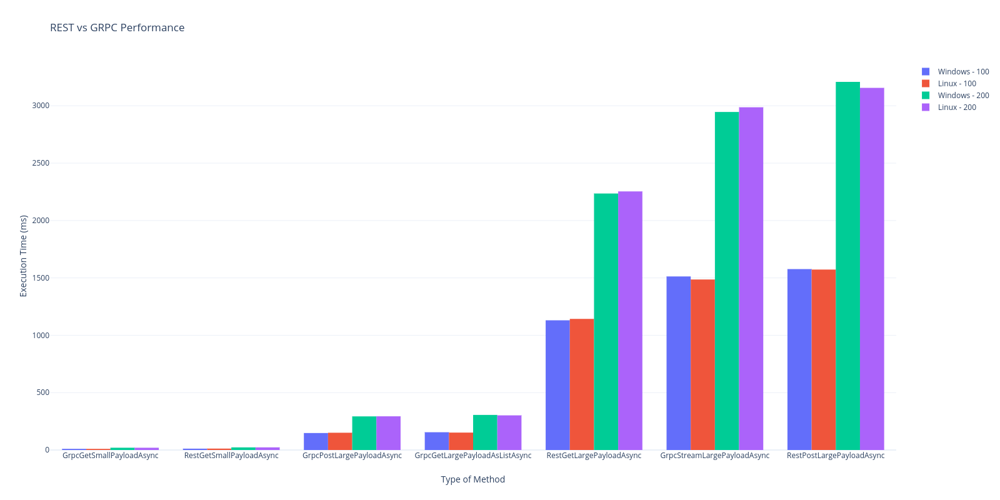
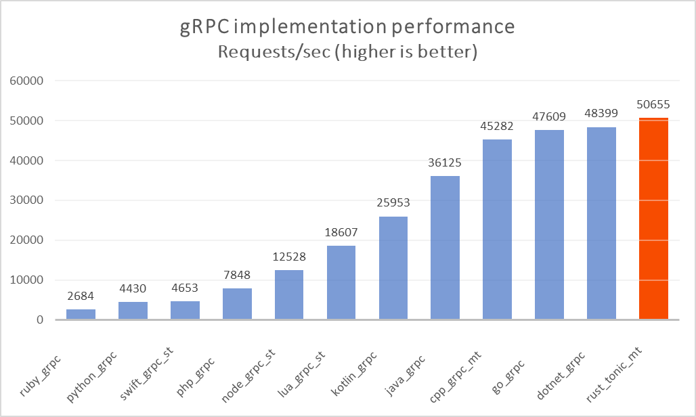
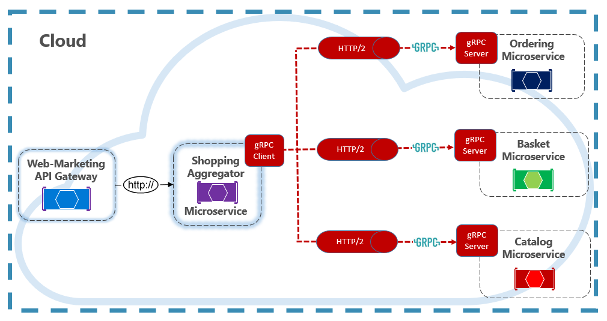

# <!--fit--> PV281: Programování v Rustu

---

# Obsah

1. gRPC
2. Protocol Buffers
3. Tonic
4. Tonic: Healthcheck
5. Tonic: Streaming
6. Tonic: Autentizace, komprese, ...

---

# gRPC

gRPC je architektura pro rychlé a vysoce propustné propojení služeb. Protokol byl navržený Googlem jako **alternativa k RESTu**.

Umožňuje propojení služeb psaných v různých jazycích
(RPC, _Remote Procedure Call_).

Zprávy jsou předávány **v binární serializované podobě**.
Kontrakt (struktura) je definovaný pomocí Protobuf (_Protocol buffer_) mechanismu. 

---

# System architecture


---

### Why gRPC vs REST?



Osa `y` je čas, tedy čím menší tím lepší. 100 a 200 je počet iterací.

---

# Why Rust for gRPC?



---

### Scénáře použití

Synchronní komunikace mezi backendovými službami, kdy je **vyžadována okamžitá odezva**.

**Polyglotní prostředí**, které vyžaduje různé programovací jazyky.

Komunikace s nízkou latencí a vysokou propustností, kde **výkon je kritický**.

**Komunikace point-to-point v reálném čase**; gRPC dokáže předat zprávy bez dotazování a podporuje obousměrné streamování.

Prostředí s pomalou sítí; **binární zprávy gRPC jsou vždy menší** než ekvivalentní textové zprávy JSON.

---

# <!--fit--> Protocol Buffers

---

# Message

Data jsou předávána jako message. Položkám říkáme field.

```protobuf
message Person {
  string name = 1;
  int32 id = 2;
  bool has_ponycopter = 3;
}
```

---

# Service 

Services jsou akce, které můžeme provolat a vrátí nám odpověď.

```protobuf
// The greeter service definition.
service Greeter {
  // Sends a greeting
  rpc SayHello (HelloRequest) returns (HelloReply) {}
}

// The request message containing the user's name.
message HelloRequest {
  string name = 1;
}

// The response message containing the greetings
message HelloReply {
  string message = 1;
}
```

---

# Streaming

Data je možné streamovat.

```protobuf
rpc BidiHello(stream HelloRequest) returns (stream HelloResponse);
//                                          ^^^^^^ - zde je rozdíl
```

---

<style scoped>
td, th {
    font-size: medium;
}
</style>

# Typy

| Type     | Notes                                                                                                         |
|----------|---------------------------------------------------------------------------------------------------------------|
| double   |
| float    |
| int32    | Uses **variable-length encoding**. Inefficient for negative numbers, use `sint32` for those instead.          |
| int64    | Uses **variable-length encoding**. Inefficient for negative numbers, use `sint64` for those instead.          |
| uint32   | Uses **variable-length encoding**.                                                                            |
| uint64   | Uses **variable-length encoding**.                                                                            |
| sint32   | Uses **variable-length encoding**. Signed int value. More efficiently encodes negative numbers than `int32`s. |
| sint64   | Uses **variable-length encoding**. Signed int value. More efficiently encodes negative numbers than `int64`s. |
| fixed32  | Always **four bytes**. More efficient than `uint32` if values are often greater than 228.                     |
| fixed64  | Always **eight bytes**. More efficient than `uint64` if values are often greater than 256.                    |
| sfixed32 | Always **four bytes**.                                                                                        |
| sfixed64 | Always **eight bytes**.                                                                                       |
| bool     |
| string   | A string must always contain **UTF-8 encoded or 7-bit ASCII** text, and cannot be longer than 232.            |
| bytes    | May contain **any arbitrary sequence of bytes** no longer than 232.                                           |

---

# Výčet

```protobuf
message MyMessage1 {
  enum EnumAllowingAlias {
    option allow_alias = true;
    UNKNOWN = 0;
    STARTED = 1;
    RUNNING = 1;
  }
}
```

---

# Repeated

Ekvivalent listu nebo vectoru.

```protobuf
message SearchResponse {
  repeated Result results = 1;
}

message Result {
  string url = 1;
  string title = 2;
  repeated string snippets = 3;
}
```

---

# Map

```protobuf
message Result {
  string url = 1;
  string title = 2;
  map<int32, string> my_map = 4;
}
```

---

# Wellknown types

```protobuf
import "google/protobuf/timestamp.proto";
import "google/protobuf/empty.proto";

message SalesOrder 
{
   int32 SoId = 1;
   google.protobuf.Timestamp DeliveryDate = 2;
}
```

---

# Chybové kódy

```golang
const (
	OK Code = 0
	Canceled Code = 1
	Unknown Code = 2
	InvalidArgument Code = 3
	DeadlineExceeded Code = 4
	NotFound Code = 5
	AlreadyExists Code = 6
	PermissionDenied Code = 7
	ResourceExhausted Code = 8
	FailedPrecondition Code = 9
	Aborted Code = 10
	OutOfRange Code = 11
	Unimplemented Code = 12
	Internal Code = 13
	Unavailable Code = 14
	DataLoss Code = 15
	Unauthenticated Code = 16
)
```

---

# GRPC web

Přechodová vrstva mezi prohlížečem a GRPC serverem.

Často využívá proxy.

Komunikuje přes HTTP2 s možností fallbacku na HTTP1 (chunky).

---

# Identity Server

- open-source řešení `Ory Kratos`
- pro OAuth2 `Ory Hydra`

---

# Poznámky

Auth se řeší přes metadata.
Obsluha je na úrovni jazyka/platformy, kterou využíváme.

Ne vždy musí být gRPC rychlejší než REST.

---

# <!--fit--> Tonic

---

# Závislosti

Od verze [0.8](https://github.com/hyperium/tonic#dependencies) je nejprve nutné nainstalovat nainstalovat `protoc`, překladač protobuf souborů:

Windows:
`https://github.com/protocolbuffers/protobuf/releases/tag/v21.9`

MacOs:
`brew install protobuf`

Ubuntu:
`sudo apt install -y protobuf-compiler libprotobuf-dev`

---

# Závislosti

```toml
[dependencies]
tonic = "0.8"
prost = "0.11"
futures-core = "0.3"
futures-util = "0.3"
tokio = { version = "1", features = ["rt-multi-thread", "macros", "sync", "time"] }
tokio-stream = "0.1"

async-stream = "0.3"
serde = { version = "1.0", features = ["derive"] }
serde_json = "1.0"
rand = "0.8"

[build-dependencies]
tonic-build = "0.8"
```

---

# Definice service

Definici jsme viděli dříve, uložíme ji do souboru `proto/greeter.proto`:

```protobuf
syntax = "proto3";       // `proto1` is deprecated, `proto2` and `proto3` have differences between them
package greeter_service; // optional, will become useful for importing into code

service Greeter {
  rpc SayHello (HelloRequest) returns (HelloReply) {}
}

message HelloRequest {
  string name = 1;
}

message HelloReply {
  string message = 1;
}
```

---

# Build&#46;rs

Soubor `build.rs` v rootu projektu je obecně skript, který se spouští před kompilací samotného projektu.

V případě Tonicu ho použijeme pro vygenerování kódu z našich definic:    

```rust
use tonic_build::compile_protos;

fn main() {
    compile_protos("proto/greeter.proto") // <- Soubor z předchozího slidu.
        .unwrap_or_else(|e| panic!("Failed to compile protos {:?}", e));
}
```

---

# Build script

Poznámka: pro `rust-analyzer` i `IntelliJ Rust` je nutné explicitně povolit parametry, aby IDE pracovalo s vygenerovaným kódem.

#### rust-analyzer
`"rust-analyzer.cargo.buildScripts.enable": true`

#### IntelliJ Rust
`org.rust.cargo.evaluate.build.scripts`
(původně _Experimental Feature_, od verze `181` z října 2022 už zapnutá by default)

---

### Server – přístup k nagenerovanému kódu

```rust
pub mod greeter_service {
    use tonic::include_proto;
    
    // The string specified here must match the proto package name.
    // If no package name is specified, use "_".
    include_proto!("greeter_service");
}
```

---

# Server – implementace

```rust
use tonic::{Request, Response, Status};
use greeter_service::{greeter_server::Greeter, HelloReply, HelloRequest}; // <- Module from the previous slide.

#[derive(Debug, Default)]
pub struct MyGreeter {}

#[tonic::async_trait]
impl Greeter for MyGreeter {
    // Accept request of type HelloRequest, return an instance of type HelloReply.
    async fn say_hello(
        &self,
        request: Request<HelloRequest>,
    ) -> Result<Response<HelloReply>, Status> {
        println!("Got a request: {:?}", request);

        let reply = greeter_service::HelloReply {
            message: format!("Hello {}!", request.into_inner().name),
        };

        Ok(Response::new(reply)) // Send back our formatted greeting.
    }
}
```

---

# Server – main

```rust
use greeter_service::greeter_server::GreeterServer;
use tonic::transport::Server;

#[tokio::main]
async fn main() -> Result<(), Box<dyn std::error::Error>> {
    let addr = "[::1]:50051".parse()?;
    let greeter = MyGreeter::default();

    Server::builder()
        .add_service(GreeterServer::new(greeter))
        .serve(addr)
        .await?;

    Ok(())
}
```

---

### Klient – přístup k nagenerovanému kódu

```rust
pub mod greeter_service {
    use tonic::include_proto;
    
    include_proto!("greeter_service");
}
```

---

# Klient – main

```rust
use greeter_service::greeter_client::GreeterClient;
use greeter_service::HelloRequest;

#[tokio::main]
async fn main() -> Result<(), Box<dyn std::error::Error>> {
    let mut client = GreeterClient::connect("http://[::1]:50051").await?;

    let request = tonic::Request::new(HelloRequest {
        name: "Tonic".into(),
    });

    let response = client.say_hello(request).await?;

    println!("Got a response: {:?}", response);

    Ok(())
}
```

---

<!-- _class: split -->

### Ukázka běhu

<div class=left-column>

#### Server

```
$ cargo run --bin server

Got a request: Request {
    metadata: MetadataMap {
        headers: {
            "te": "trailers",
            "content-type": "application/grpc",
            "user-agent": "tonic/0.8.2"
        }
    },
    message: HelloRequest {
        name: "Tonic"
    },
    extensions: Extensions
}

```

</div>
<div class=right-column>

#### Klient

```
$ cargo run --bin client

Got a response: Response {
    metadata: MetadataMap {
        headers: {
            "content-type": "application/grpc",
            "date": "Mon, 21 Nov 2022 18:08:58 GMT",
            "grpc-status": "0"
        }
    },
    message: HelloReply {
        message: "Hello Tonic!"
    },
    extensions: Extensions
}

Process finished with exit code 0
```

</div>

---

# <!--fit--> Tokio: Healthcheck

`tonic_health = "0.7"`

---

# Healthcheck – main

```rust
use tonic::{transport::Server, Request, Response, Status};
use tonic_health::server::HealthReporter;

#[tokio::main]
async fn main() -> Result<(), Box<dyn std::error::Error>> {
    let (mut health_reporter, health_service) = tonic_health::server::health_reporter();
    
    health_reporter.set_serving::<GreeterServer<MyGreeter>>().await;

    tokio::spawn(twiddle_service_status(health_reporter.clone())); // Execute the testing function on a separate worker.

    let address = "[::1]:50051".parse().unwrap();
    let greeter = MyGreeter::default();

    println!("HealthServer listening on {}", address);
    Server::builder()
        .add_service(health_service)
        .add_service(GreeterServer::new(greeter)) add your service
        .serve(address)
        .await?;

    Ok(())
} // Continued on the next slide...
```

---

# Healthcheck – testing function

```rust
/// This function (somewhat improbably) flips the status of a service every second, in order
/// that the effect of `tonic_health::HealthReporter::watch` can be easily observed.
async fn twiddle_service_status(mut reporter: HealthReporter) {
    let mut iter = 0u64;
    loop {
        iter += 1;
        tokio::time::sleep(Duration::from_secs(1)).await;

        if iter % 2 == 0 {
            reporter.set_serving::<GreeterServer<MyGreeter>>().await;
        } else {
            reporter.set_not_serving::<GreeterServer<MyGreeter>>().await;
        };
    }
}
```

---

# <!--fit--> Tokio: Streaming

---

# Streaming – definice

```protobuf
syntax = "proto3";
package grpc.examples.echo;

// EchoRequest is the request for echo.
message EchoRequest {
    string message = 1;
}

// EchoResponse is the response for echo.
message EchoResponse {
    string message = 1;
}

// Echo is the echo service.
service Echo {
    rpc UnaryEcho(EchoRequest) returns (EchoResponse) {}
    rpc ServerStreamingEcho(EchoRequest) returns (stream EchoResponse) {}
    rpc ClientStreamingEcho(stream EchoRequest) returns (EchoResponse) {}
    rpc BidirectionalStreamingEcho(stream EchoRequest) returns (stream EchoResponse) {}
}
```

---

# Streaming – build&#46;rs

```rust
use std::{env, path::PathBuf};

fn main() {
    tonic_build::compile_protos("proto/echo/echo.proto").unwrap();

    tonic_build::configure()
        .server_mod_attribute("attrs", "#[cfg(feature = \"server\")]")
        .server_attribute("Echo", "#[derive(PartialEq)]")
        .client_mod_attribute("attrs", "#[cfg(feature = \"client\")]")
        .client_attribute("Echo", "#[derive(PartialEq)]")
        .compile(&["proto/attrs/attrs.proto"], &["proto"])
        .unwrap();
}
```

---

# Streaming – main&#46;rs klienta

```rust
use futures::stream::Stream;
use std::time::Duration;
use tokio_stream::StreamExt;
use tonic::transport::Channel;

pub mod pb {
    tonic::include_proto!("grpc.examples.echo");
}
use pb::{echo_client::EchoClient, EchoRequest};

#[tokio::main]
async fn main() -> Result<(), Box<dyn std::error::Error>> {
    let mut client = EchoClient::connect("http://[::1]:50051").await.unwrap();

    println!("Streaming echo:");
    streaming_echo(&mut client, 5).await;

    Ok(())
}
```

---

# Streaming – main&#46;rs klienta

```rust
async fn streaming_echo(client: &mut EchoClient<Channel>, num: usize) {
    let stream = client
        .server_streaming_echo(EchoRequest {
            message: "foo".into(),
        })
        .await
        .unwrap()
        .into_inner();

    // stream is infinite - take just 5 elements and then disconnect
    let mut stream = stream.take(num);
    while let Some(item) = stream.next().await {
        println!("  received: {}", item.unwrap().message);
    }
    // stream is droped here and the disconnect info is send to server
}
```

---

# Streaming – main&#46;rs serveru

```rust
use futures::Stream;
use std::{error::Error, io::ErrorKind, net::ToSocketAddrs, pin::Pin, time::Duration};
use tokio::sync::mpsc;
use tokio_stream::{wrappers::ReceiverStream, StreamExt};
use tonic::{transport::Server, Request, Response, Status, Streaming};

pub mod pb {
    tonic::include_proto!("grpc.examples.echo");
}
use pb::{EchoRequest, EchoResponse};

type EchoResult<T> = Result<Response<T>, Status>;
type ResponseStream = Pin<Box<dyn Stream<Item = Result<EchoResponse, Status>> + Send>>;

#[tokio::main]
async fn main() -> Result<(), Box<dyn std::error::Error>> {
    let server = EchoServer {};
    Server::builder()
        .add_service(pb::echo_server::EchoServer::new(server))
        .serve("[::1]:50051".to_socket_addrs().unwrap().next().unwrap())
        .await
        .unwrap();

    Ok(())
}
```

---

# Streaming – server side

```rust
#[derive(Debug)]
pub struct EchoServer {}

#[tonic::async_trait]
impl pb::echo_server::Echo for EchoServer {
    type ServerStreamingEchoStream = ResponseStream;

    async fn server_streaming_echo(&self, req: Request<EchoRequest>) -> EchoResult<Self::ServerStreamingEchoStream> {
        println!("EchoServer::server_streaming_echo \n  client connected from: {:?}", req.remote_addr());

        // Creating an infinite stream with the requested message:
        let repeat = std::iter::repeat(EchoResponse { message: req.into_inner().message });
        let mut stream = Box::pin(tokio_stream::iter(repeat).throttle(Duration::from_millis(200)));

        // spawn and channel are required if you want handle "disconnect" functionality; the `out_stream` will not be polled after client disconnect
        let (tx, rx) = mpsc::channel(128);
        tokio::spawn(async move {
            while let Some(item) = stream.next().await {
                match tx.send(Result::<_, Status>::Ok(item)).await {
                    Ok(_) => {}, // item (server response) was queued to be send to client
                    Err(_item) => break, // output_stream was build from rx and both are dropped
                }
            }
            println!("  client disconnected");
        });

        let output_stream = ReceiverStream::new(rx);
        Ok(Response::new(Box::pin(output_stream) as Self::ServerStreamingEchoStream))
    }
}
```

---

# Streaming – client side

```rust
#[derive(Debug)]
pub struct EchoServer {}

#[tonic::async_trait]
impl pb::echo_server::Echo for EchoServer {
    type ServerStreamingEchoStream = ResponseStream;

    async fn client_streaming_echo(
        &self,
        req: Request<Streaming<EchoRequest>>,
    ) -> EchoResult<EchoResponse> {

        let mut in_stream = req.into_inner();

        // this spawn here is required if you want to handle connection error.
        tokio::spawn(async move {
            while let Some(result) = in_stream.next().await {
                // ...
            }
        }
    }
}
```

---

# Streaming – bidirectional

```rust
#[tonic::async_trait]
impl pb::echo_server::Echo for EchoServer {
    type ServerStreamingEchoStream = ResponseStream;

    async fn bidirectional_streaming_echo(&self, req: Request<Streaming<EchoRequest>>) -> EchoResult<Self::BidirectionalStreamingEchoStream> {
        println!("EchoServer::bidirectional_streaming_echo");

        let mut in_stream = req.into_inner();
        let (tx, rx) = mpsc::channel(128);

        // If we just map `in_stream` and write it back as `out_stream`, the `out_stream` will be drooped when connection error occurs
        // and error will never be propagated to mapped version of `in_stream`.
        tokio::spawn(async move {
            // Continued on the next slide!
        });

        // echo just write the same data that was received
        let out_stream = ReceiverStream::new(rx);

        Ok(Response::new(
            Box::pin(out_stream) as Self::BidirectionalStreamingEchoStream
        ))
    }
}
```

---

# Streaming – bidirectional task

```rust
// ...
tokio::spawn(async move {
    while let Some(result) = in_stream.next().await {
        match result {
            Ok(v) => tx
                .send(Ok(EchoResponse { message: v.message }))
                .await
                .expect("working rx"),
            Err(err) => {
                if let Some(io_err) = match_for_io_error(&err) {
                    if io_err.kind() == ErrorKind::BrokenPipe {
                        eprintln!("  client disconnected: broken pipe"); // here you can handle special case when client disconnected in unexpected way
                        break;
                    }
                }
    
                match tx.send(Err(err)).await {
                    Ok(_) => (),
                    Err(_err) => break, // response was droped
                }
            }
        }
    }
    println!("  stream ended");
});
// ...
```

---

# <!--fit--> Tonic: Autentizace, komprese, ...

---

# Autentizace na klientovi

```rust
pub mod pb {
    tonic::include_proto!("grpc.examples.echo");
}

use pb::{echo_client::EchoClient, EchoRequest};
use tonic::{metadata::MetadataValue, transport::Channel, Request};

#[tokio::main]
async fn main() -> Result<(), Box<dyn std::error::Error>> {
    let channel = Channel::from_static("http://[::1]:50051").connect().await?;

    let token = MetadataValue::from_str("Bearer some-auth-token")?;

    let mut client = EchoClient::with_interceptor(channel, move |mut req: Request<()>| {
        req.metadata_mut().insert("authorization", token.clone());
        Ok(req)
    });

    let request = tonic::Request::new(EchoRequest {
        message: "hello".into(),
    });

    let response = client.unary_echo(request).await?;

    println!("RESPONSE={:?}", response);

    Ok(())
}
```

---

# Komprese pomocí gzip

```rust
use hello_world::greeter_client::GreeterClient;
use hello_world::HelloRequest;
use tonic::transport::Channel;

pub mod hello_world {
    tonic::include_proto!("helloworld");
}

#[tokio::main]
async fn main() -> Result<(), Box<dyn std::error::Error>> {
    let channel = Channel::builder("http://[::1]:50051".parse().unwrap())
        .connect()
        .await
        .unwrap();

    let mut client = GreeterClient::new(channel).send_gzip().accept_gzip();

    let request = tonic::Request::new(HelloRequest {
        name: "Tonic".into(),
    });

    let response = client.say_hello(request).await?;

    dbg!(response);

    Ok(())
}
```

---

<!-- _class: split -->

### gRPC Web

<div class=left-column>

```rust
use tonic::{transport::Server, Request, Response, Status};

use greeter_service::greeter_server::{Greeter, GreeterServer};
use greeter_service::{HelloReply, HelloRequest};

pub mod greeter_service {
    tonic::include_proto!("greeter_service");
}

#[derive(Default)]
pub struct MyGreeter {}

#[tonic::async_trait]
impl Greeter for MyGreeter {
    async fn say_hello(
        &self,
        request: Request<HelloRequest>,
    ) -> Result<Response<HelloReply>, Status> {
        println!("Got a request from {:?}", request.remote_addr());

        let reply = hello_world::HelloReply {
            message: format!("Hello {}!", request.into_inner().name),
        };
        Ok(Response::new(reply))
    }
}
```

</div>
<div class=right-column>

```rust
#[tokio::main]
async fn main() -> Result<(), Box<dyn std::error::Error>> {
    tracing_subscriber::fmt::init();

    let addr = "127.0.0.1:3000".parse().unwrap();

    let greeter = MyGreeter::default();
    let greeter = GreeterServer::new(greeter);
    let greeter = tonic_web::config()
        .allow_origins(vec!["127.0.0.1"])
        .enable(greeter);

    println!("GreeterServer listening on {}", addr);

    Server::builder()
        .accept_http1(true)
        .add_service(greeter)
        .serve(addr)
        .await?;

    Ok(())
}
```

</div>

---

# REST gateway před GRPC



---

# Performance optimalizace

- pro udržení spojení použijte **keepalive ping**
- pro větší flow využijte **streaming**

---

# <!--fit--> Dotazy?

---

# <!--fit--> Děkuji za pozornost

