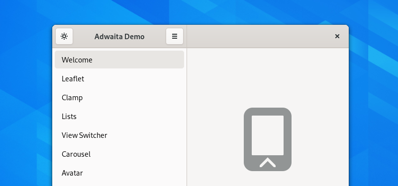
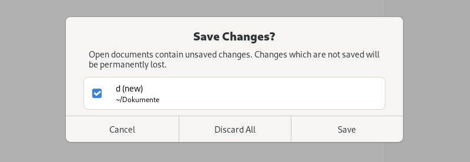
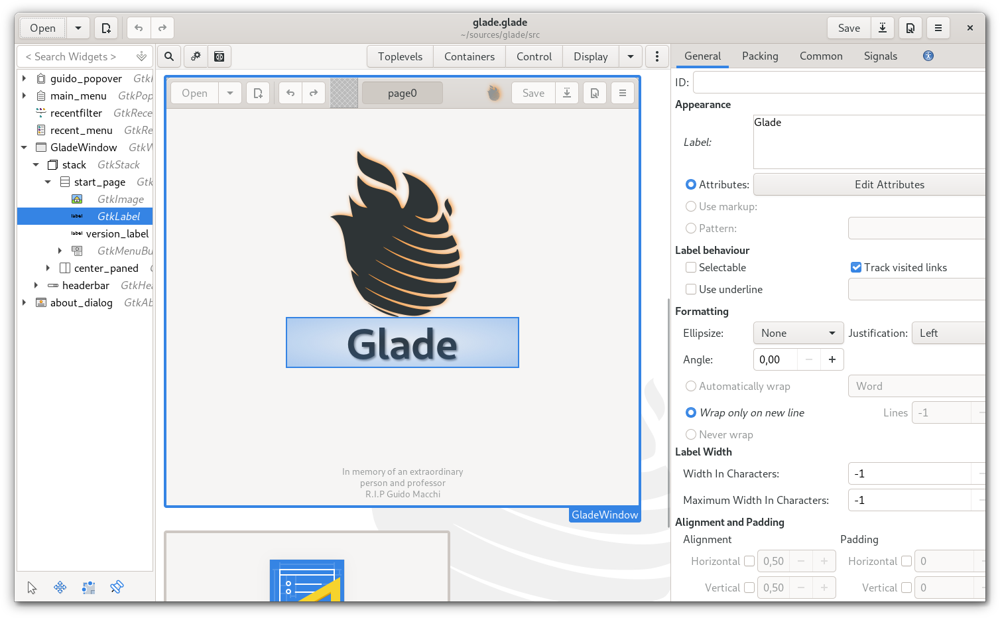

# <!--fit--> PV281: Programování v Rustu

---

# Obsah

1. Přístupy k vývoji desktopových aplikací
2. GTK 4
3. Tauri

---

# <!--fit--> Přístupy k vývoji desktopových aplikací

---

# Koncept okna


---

# Header bar


---

# Sidebar



---

# Taby


---

# Dialog



---

# <!--fit--> GTK 4

---

# GTK 4

GTK je multiplatformní knihovna pro tvorbu UI.

Je psaná v C, takže se vyžívá bindingů pro Rust.

---

<style scoped>
td, th {
    font-size: large;
}
</style>

# Závislosti

```toml
gtk = { version = "0.5.2", package = "gtk4" }

# Notice that we are renaming the package from `gtk4` to just `gtk`.
```

Kromě toho je potřeba nainstalovat knihovny pro vývoj [dle dokumentace](https://www.gtk.org/docs/installations/), např. pro UN*X:

| Distribution  | Binary package | Development package | Additional packages |
|---------------|----------------|---------------------|---------------------|
| Arch          | `gtk4`         | -                   | -                   |
| Debian/Ubuntu | `libgtk-4-1`   | `libgtk-4-dev`      | `gtk-4-examples`    |
| Fedora        | `gtk4 `        | `gtk4-devel`        | -                   |

---

# Vytvoření aplikace

```rust
use gtk::prelude::*;
use gtk::Application;

fn main() {
    let app = Application::builder()          // Create a new application
        .application_id("org.gtk-rs.example")
        .build();

    app.run();                                // Run the application
}
```

---

# Vytvoření okna

```rust
use gtk::{Application, ApplicationWindow, prelude::*};

fn main() {
    let app = Application::builder()          // Create a new application
        .application_id("org.gtk-rs.example")
        .build();

    app.connect_activate(build_ui);           // Connect to "activate" signal of `app`

    app.run();                                // Run the application
}

fn build_ui(app: &Application) {
    let window = ApplicationWindow::builder() // Create a window and set the title
        .application(app)
        .title("My GTK App")
        .build();

    window.present();                         // Present window to the user
}
```

---

# Přidání tlačítka

```rust
fn build_ui(app: &Application) {
    let window = ApplicationWindow::builder() // Create a window and set the title
        .application(app)
        .title("My GTK App")
        .build();

    let button = Button::builder()            // Create a button with label and margins
        .label("Press me!")
        .margin_top(12)
        .margin_bottom(12)
        .margin_start(12)
        .margin_end(12)
        .build();

    button.connect_clicked(move |button| {    // Connect to "clicked" signal of `button`
        button.set_label("Hello World!");     // Set the label to "Hello World!" after the button has been clicked on
    });

    window.set_child(Some(&button));          // Add button

    window.present();                         // Present window to the user
}
```

---

# Události (signály)

```rust
    // ...
    
    button.connect_local("clicked", false, move |args| { // Connect callback
        let button = args[0]                             // Get the button from the arguments
            .get::<Button>()
            .expect("Expected type `Button`");
            
        button.set_label("Hello World!");                // Set the label after the button has been clicked
        
        None
    });
    
    // ...
```

---


<!-- _class: split -->

### Zobrazení dialogu

<div class=left-column>

```rust
use gtk::{glib::clone, prelude::*};
use std::rc::Rc;

fn main() {
    let application = gtk::Application::builder()
        .application_id("com.github.gtk-rs.examples.dialog")
        .build();

    application.connect_activate(build_ui);
    application.run();
}

fn build_ui(application: &gtk::Application) {
    // ...created button and window using builder patterns

    button.connect_clicked(clone!(@strong window =>
        move |_| {
            gtk::glib::MainContext::default()
                .spawn_local(my_dialog(Rc::clone(&window)));
        }
    ));
}
```

</div>
<div class=right-column>

```rust
async fn my_dialog<W: IsA<gtk::Window>>(window: Rc<W>) {
    let question_dialog = gtk::MessageDialog::builder()
        .transient_for(&*window)
        .modal(true)
        .buttons(gtk::ButtonsType::OkCancel)
        .text("What is your answer?")
        .build();

    let answer = question_dialog.run_future().await;
    question_dialog.close();

    let info_dialog = gtk::MessageDialog::builder()
        .transient_for(&*window)
        .modal(true)
        .buttons(gtk::ButtonsType::Close)
        .text("You answered")
        .secondary_text(&format!("Your answer: {:?}", answer))
        .build();

    info_dialog.run_future().await;
    info_dialog.close();
}
```

</div>

---

# Definice prvků přes XML

```xml
<?xml version="1.0" encoding="UTF-8"?>
<interface>
  <object class="GtkApplicationWindow" id="window">
    <property name="title">My GTK App</property>
    <child>
      <object class="GtkButton" id="button">
        <property name="label">Press me!</property>
        <property name="margin-top">12</property>
        <property name="margin-bottom">12</property>
        <property name="margin-start">12</property>
        <property name="margin-end">12</property>  
      </object>
    </child>
  </object>
</interface>
```

---

# Provázání XML definice a kódu

```rust
fn build_ui(app: &Application) {
    let builder = gtk::Builder::from_string(include_str!("window.ui")); // Init builder from file

    let window: ApplicationWindow = builder                             // Get object of id="window" from the builder
        .object("window")
        .expect("Could not get object `window` from builder.");
   
    let button: Button = builder                                        // Get object of id="button" from the builder
        .object("button")
        .expect("Could not get object `button` from builder.");

    window.set_application(Some(app));                                  // Set application

    button.connect_clicked(move |button| {                              // Connect to "clicked" signal
        button.set_label("Hello World!");                               // Set the label after the button has been clicked
    });

    window.set_child(Some(&button));                                    // Add button
    window.present();
}
```

---

# Vytvoření menu

```xml
<?xml version="1.0" encoding="UTF-8"?>
<interface>
  <menu id="menu">
    <section>
      <item>
        <attribute name="label" translatable="yes">Incendio</attribute>
        <attribute name="action">app.incendio</attribute>
      </item>
    </section>
    <section>
      <attribute name="label" translatable="yes">Defensive Charms</attribute>
      <item>
        <attribute name="label" translatable="yes">Expelliarmus</attribute>
        <attribute name="action">app.expelliarmus</attribute>
        <attribute name="icon">/usr/share/my-app/poof!.png</attribute>
      </item>
    </section>
  </menu>
</interface>
```

---

# Akce

```rust
impl Window {
    pub fn new(app: &Application) -> Self {
        // Create new window
        Object::new(&[("application", app)]).expect("Failed to create Window")
    }

    fn add_actions(&self) {
        let imp = imp::Window::from_instance(self);
        let label = imp.label.get();

        // Add stateful action "count" to `window` taking an integer as parameter
        let original_state = 0;
        let action_count = SimpleAction::new_stateful(
            "count",
            Some(&i32::static_variant_type()),
            &original_state.to_variant(),
        );

        action_count.connect_activate(clone!(@weak label => move |action, parameter| {
            // Get state
            let mut state = action
                .state()
                .expect("Could not get state.")
                .get::<i32>()
                .expect("The value needs to be of type `i32`.");

            // Get parameter
            let parameter = parameter
                .expect("Could not get parameter.")
                .get::<i32>()
                .expect("The value needs to be of type `i32`.");

            // Increase state by parameter and save state
            state += parameter;
            action.set_state(&state.to_variant());

            // Update label with new state
            label.set_label(&format!("Counter: {}", state));
        }));
        self.add_action(&action_count);
    }
}
```

---

<!-- _class: split -->

### Stylování přes CSS


<div class=left-column>

```rust
use gtk::{
    Application, ApplicationWindow, Box as Box_, Button, ComboBoxText,
    CssProvider,Entry, gdk::Display,  prelude::*, Orientation,
    StyleContext, STYLE_PROVIDER_PRIORITY_APPLICATION
};

fn main() {
    let application = Application::new(
        Some("com.github.css"), Default::default()
    );
    
    // The CSS "magic" happens here.
    application.connect_startup(|app| {
        let provider = CssProvider::new();
        provider.load_from_data(include_bytes!("style.css"));
        
        // Give the provider to the screen so the CSS rules are applied.
        StyleContext::add_provider_for_display(
            &Display::default().expect("Error initializing gtk css provider."),
            &provider,                                                                
            STYLE_PROVIDER_PRIORITY_APPLICATION,
        );
        
        // We build the application UI.
        build_ui(app);
    });
    
    application.run();
}
```

</div>
<div class=right-column>

```rust
fn build_ui(application: &Application) {
    let window = ApplicationWindow::new(application);
    window.set_title(Some("CSS"));

    let button = Button::with_label("hover me!");
    button.add_css_class("button1");

    let entry = Entry::new();
    entry.add_css_class("entry1");
    entry.set_text("Some text");

    let combo = ComboBoxText::new();
    combo.append_text("option 1");
    combo.append_text("option 2");
    combo.append_text("option 3");
    combo.set_active(Some(0));

    let vbox = Box_::new(Orientation::Vertical, 0);
    vbox.append(&button);
    vbox.append(&entry);
    vbox.append(&combo);
   
    window.set_child(Some(&vbox));                                                   
    application.connect_activate(move |_| {
        window.show();
    });
}
```

</div>

---

# Stylování přes CSS

```css
/* style.css */

entry.entry1 {
    background: linear-gradient(to right, #f00, #0f0);
    color: blue;
    font-weight: bold;
}

button {
    /* If we don't put it, the yellow background won't be visible */
    background-image: none;
}

button.button1:hover {
    transition: 500ms;
    color: red;
    background-color: yellow;
}

combobox button.combo box {
    padding: 5px;
}
combobox box arrow {
    -gtk-icon-source: -gtk-icontheme('pan-down-symbolic');
    border-left: 5px solid transparent;
    border-right: 5px solid transparent;
    border-top: 5px solid black;
}
```

---

# Glade



---

# <!--fit--> Tauri

---

# Tauri

- postavené na podobných principech jako Electron
- využívá webview pro renderování HTML
- pro tvorbu view využíváme HTML a související technologie
- logiku a další důležité součásti vytváříme přes Rust

---

# Instalace

Je nutné mít nainstalovaný Node.
Doporučujeme instalovat přes NVM.

Kromě Node musíte nainstalovat [webview2](https://developer.microsoft.com/en-us/microsoft-edge/webview2/#download-section).

Pro vývoj na UN*Xu jsou také potřeba [další knihovny](https://tauri.app/v1/guides/getting-started/prerequisites/#setting-up-linux).

---

# Vytvoření projektu

```sh
corepack enable

pnpm create tauri-app
```

```sh
# cargo install tauri-cli
cargo tauri init # alternativne `pnpm tauri init`

cargo tauri dev
```

---

# Výchozí struktura projektu

```
src-tauri
├── Cargo.toml
├── tauri.conf.json
└── src
    └── main.rs
```

---

# Spuštění aplikace

```pnpm tauri dev```

```cargo tauri dev```

---

# Rust Commands

```rust
#[tauri::command]
fn my_custom_command() {
  println!("I was invoked from JS!");
}

fn main() {
  tauri::Builder::default()
    .invoke_handler(tauri::generate_handler![my_custom_command]) // <- This is new.
    .run(tauri::generate_context!())
    .expect("failed to run app");
}
```

---

# Zavolání z JS aplikace

### `tauri.conf.json`
```json
{
  "build": {
    "beforeBuildCommand": "",
    "beforeDevCommand": "",
    "devPath": "../ui",
    "distDir": "../ui",
    "withGlobalTauri": true
  },
```

---

# Zavolání z JS aplikace

```javascript
import { invoke } from '@tauri-apps/api/tauri'
// With the Tauri global script, enabled when `tauri.conf.json > build > withGlobalTauri` is set to true:
const invoke = window.__TAURI__.invoke

// Invoke the command
invoke('my_custom_command').then((response) => console.log(response))
```

---

# Předávání argumentů

Parametrem může být cokoliv umožňující deserializaci přes Serde.

Command

```rust
#[tauri::command]
fn my_custom_command(invoke_message: String) {
  println!("I was invoked from JS, with this message: {}", invoke_message);
}
```

A jeho následné provolání

```js
invoke('my_custom_command', { invokeMessage: 'Hello!' })
```

---

# Návratová hodnota

Návratovou hodnotou může být cokoliv implementující Serde::Serialize

```rust
#[tauri::command]
fn my_custom_command() -> String {
  "Hello from Rust!".into()
}
```

a získání přes Promise

```js
invoke('my_custom_command').then((message) => console.log(message))
```

---

# Error Handeling

```rust
#[tauri::command]
fn my_custom_command() -> Result<String, String> {
  // If something fails
  Err("This failed!".into())
  // If it worked
  Ok("This worked!".into())
}
```

lze transparentně zpracovat jako kteroukoliv JS exception.

```js
invoke('my_custom_command')
  .then((message) => console.log(message))
  .catch((error) => console.error(error))
```

---

# Události

```js
import { emit, listen } from '@tauri-apps/api/event'

// listen to the `click` event and get a function to remove the event listener
// there's also a `once` function that subscribes to an event and automatically unsubscribes the listener on the first event
const unlisten = await listen('click', event => {
  // event.event is the event name (useful if you want to use a single callback fn for multiple event types)
  // event.payload is the payload object
})

// emits the `click` event with the object payload
emit('click', {
  theMessage: 'Tauri is awesome!'
})
```

---

# Události

V rustu jsou události dostupné přes objekt Window.

```rust
use tauri::Manager;

// the payload type must implement `Serialize`.
// for global events, it also must implement `Clone`.
#[derive(Clone, serde::Serialize)]
struct Payload {
  message: String,
}

fn main() {
  tauri::Builder::default()
    .setup(|app| {
      // listen to the `event-name` (emitted on any window)
      let id = app.listen_global("event-name", |event| {
        println!("got event-name with payload {:?}", event.payload());
      });
      // unlisten to the event using the `id` returned on the `listen_global` function
      // an `once_global` API is also exposed on the `App` struct
      app.unlisten(id);

      // emit the `event-name` event to all webview windows on the frontend
      app.emit_all("event-name", Payload { message: "Tauri is awesome!".into() }).unwrap();
      Ok(())
    })
    .run(tauri::generate_context!())
    .expect("failed to run app");
}
```

---

# Události specifické pro okno

```js
import { getCurrent, WebviewWindow } from '@tauri-apps/api/window'

// emit an event that are only visible to the current window
const current = getCurrent()
current.emit('event', { message: 'Tauri is awesome!' })

// create a new webview window and emit an event only to that window
const webview = new WebviewWindow('window')
webview.emit('event')
```

---

# Události specifické pro okno

```rust
use tauri::{Manager, Window};

// the payload type must implement `Serialize`.
#[derive(serde::Serialize)]
struct Payload {
  message: String,
}

// init a background process on the command, and emit periodic events only to the window that used the command
#[tauri::command]
fn init_process(window: Window) {
  std::thread::spawn(move || {
    loop {
      window.emit("event-name", Payload { message: "Tauri is awesome!".into() }).unwrap();
    }
  });
}

fn main() {
  tauri::Builder::default()
    .setup(|app| {
      // `main` here is the window label; it is defined on the window creation or under `tauri.conf.json`
      // the default value is `main`. note that it must be unique
      let main_window = app.get_window("main").unwrap();

      // listen to the `event-name` (emitted on the `main` window)
      let id = main_window.listen("event-name", |event| {
        println!("got window event-name with payload {:?}", event.payload());
      });
      // unlisten to the event using the `id` returned on the `listen` function
      // an `once` API is also exposed on the `Window` struct
      main_window.unlisten(id);

      // emit the `event-name` event to the `main` window
      main_window.emit("event-name", Payload { message: "Tauri is awesome!".into() }).unwrap();
      Ok(())
    })
    .invoke_handler(tauri::generate_handler![init_process])
    .run(tauri::generate_context!())
    .expect("failed to run app");
}
```

---

# Vytvoření menu

```rust
use tauri::{CustomMenuItem, Menu, MenuItem, Submenu};

let quit = CustomMenuItem::new("quit".to_string(), "Quit");
let close = CustomMenuItem::new("close".to_string(), "Close");
let submenu = Submenu::new("File", Menu::new().add_item(quit).add_item(close));
let menu = Menu::new()
  .add_native_item(MenuItem::Copy)
  .add_item(CustomMenuItem::new("hide", "Hide"))
  .add_submenu(submenu);

fn main() {
  let menu = Menu::new(); // configure the menu
  tauri::Builder::default()
    .menu(menu)
    .run(tauri::generate_context!())
    .expect("error while running tauri application");
}
```

---

# Události z menu

```rust
use tauri::{CustomMenuItem, Menu, MenuItem};

fn main() {
  let menu = Menu::new(); // configure the menu
  tauri::Builder::default()
    .menu(menu)
    .on_menu_event(|event| {
      match event.menu_item_id() {
        "quit" => {
          std::process::exit(0);
        }
        "close" => {
          event.window().close().unwrap();
        }
        _ => {}
      }
    })
    .run(tauri::generate_context!())
    .expect("error while running tauri application");
}
```

---

# System tray

úprava v configu

```json
{
  "tauri": {
    "systemTray": {
      "iconPath": "icons/icon.png",
      "iconAsTemplate": true // template image pro macOs
    }
  }
}
```

---

# Vytvoření system tray

```rust
use tauri::{CustomMenuItem, SystemTray, SystemTrayMenu};

fn main() {
  let quit = CustomMenuItem::new("quit".to_string(), "Quit");
  let hide = CustomMenuItem::new("hide".to_string(), "Hide");

  let tray_menu = SystemTrayMenu::new()
    .add_item(quit)
    .add_native_item(SystemTrayMenuItem::Separator)
    .add_item(hide);

  let system_tray = SystemTray::new()
    .with_menu(tray_menu);

  tauri::Builder::default()
    .system_tray(system_tray)
    .run(tauri::generate_context!())
    .expect("error while running tauri application");
}
```

---

# Události ze system tray

```rust
use tauri::{CustomMenuItem, SystemTray, SystemTrayMenu, SystemTrayEvent};
use tauri::Manager;

fn main() {
  let tray_menu = SystemTrayMenu::new(); // insert the menu items here
  tauri::Builder::default()
    .system_tray(SystemTray::new().with_menu(tray_menu))
    .on_system_tray_event(|app, event| match event {
      SystemTrayEvent::MenuItemClick { id, .. } => {
        match id.as_str() {
          "quit" => {
            std::process::exit(0);
          }
          "hide" => {
            let window = app.get_window("main").unwrap();
            window.hide().unwrap();
          }
          _ => {}
        }
      }
      _ => {}
    })
    .run(tauri::generate_context!())
    .expect("error while running tauri application");
}
```

---

# Splashscreen

vytovříme `splashscreen.html` v `distDir` a přidáme záznam do configu.

```rust
"windows": [
  {
    "title": "Tauri App",
    "width": 800,
    "height": 600,
    "resizable": true,
    "fullscreen": false,
    "visible": false // Hide the main window by default
  },
  // Splashscreen
  {
    "width": 400,
    "height": 200,
    "decorations": false,
    "url": "splashscreen.html",
    "label": "splashscreen"
  }
]
```

---

# Splashscreen při čekání na Rust

```rust
use tauri::Manager;
fn main() {
  tauri::Builder::default()
    .setup(|app| {
      let splashscreen_window = app.get_window("splashscreen").unwrap();
      let main_window = app.get_window("main").unwrap();
      // we perform the initialization code on a new task so the app doesn't freeze
      tauri::async_runtime::spawn(async move {
        // initialize your app here instead of sleeping :)
        println!("Initializing...");
        std::thread::sleep(std::time::Duration::from_secs(2));
        println!("Done initializing.");

        // After it's done, close the splashscreen and display the main window
        splashscreen_window.close().unwrap();
        main_window.show().unwrap();
      });
      Ok(())
    })
    .run(tauri::generate_context!())
    .expect("failed to run app");
}
```

---

# Debugging přes devtools

```rust
use tauri::Manager;
tauri::Builder::default()
  .setup(|app| {
    #[cfg(debug_assertions)] // only include this code on debug builds
    {
      let window = app.get_window("main").unwrap();
      window.open_devtools();
      window.close_devtools();
    }
    Ok(())
  });
```

spuštění přes `pnpm tauri build --debug`

---

# <!--fit--> Dotazy?

---

# <!--fit--> Děkuji za pozornost
